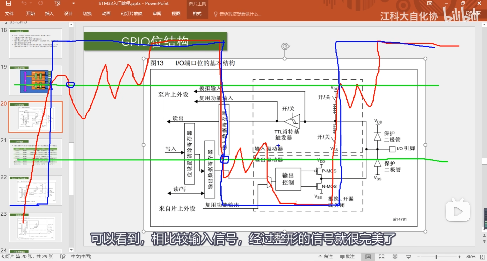

施密特触发器

cd STM32/LED_Flash_3_1
git init
git add .
git commit -m "Initial commit for LED_LED_Flash_3_1"//提交
git remote add origin https://github.com/hfhfhfhcdcdcd/LED_Flash_3_1.git
git branch -M main
git push -u origin main//同步